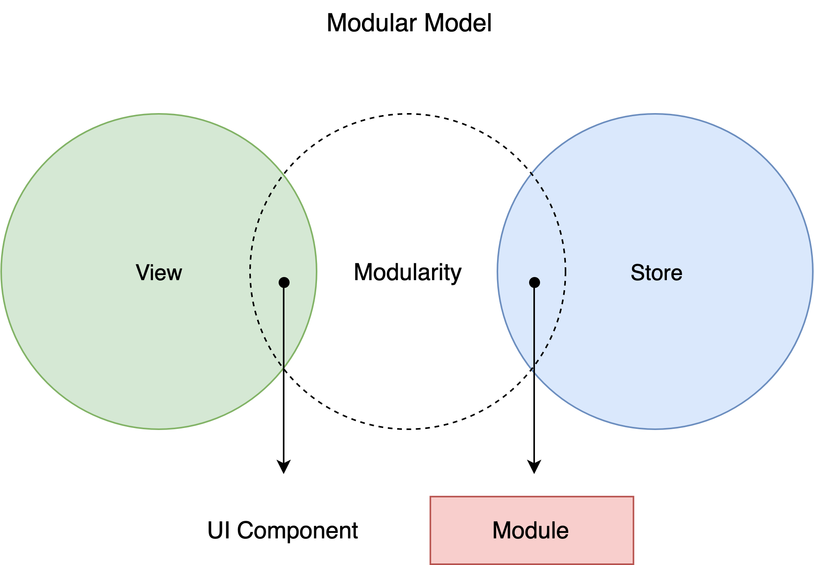

# usm

[](https://travis-ci.org/unadlib/usm)
[](https://www.npmjs.com/package/usm)

 **`usm` can help you make more concise OOP when using some state library**, and it currently supports Redux, Vuex, MobX and Angular.

> `usm` is a universal state modular library.



## Table of Contents

- [Support](#support)
- [Features](#features)
- [Quick Start for React](#quick-start-for-react)
- [Usage](#usage)
- [Pros](#pros)
- [Articles & Presentation](#articles)
- [Examples](#examples)
- [Migration](#migration)
- [APIs](#apis)
  - [Decorators](#decorators)
  - [Module lifecycle](#module-lifecycle)
- [FAQ](#faq)

## Support

| Libraries/Frameworks   | None  | Redux  | MobX    | Vuex    | Angular2+ |
| :--------------------- | :---: | :----: | :-----: | :-----: | :-------: |
| Status                 | ✅    | ✅     | ✅     | ✅      | ✅        |

## Features

- Universal State Management
- Standardized Module Lifecycle
- Optional Event System
- Support Stateless Model
- Support React/Vue/Angular

## Usage

To install `usm`:

```bash
yarn add usm # npm install --save usm
```

if you want to use Redux/MobX/Vuex, just install `usm-redux`/`usm-mobx`/`usm-vuex` correspondingly.

---

You should install babel plugins:

```bash
yarn add --dev @babel/plugin-proposal-decorators @babel/plugin-proposal-class-properties
```

Add the following line to your .babelrc or babel.config.js file:

```
{
  "plugins": [
    ["@babel/plugin-proposal-decorators", { "legacy": true }],
    ["@babel/plugin-proposal-class-properties", { "loose" : true }]
  ]
}
```

## Quick Start for React

1. Build a project with `create-react-app`.

```sh
npx create-react-app usm-redux-example
cd usm-redux-example
yarn eject
```

2. Install `usm-redux` and other dependences package.

```sh
yarn add usm-redux react-redux
yarn add --dev @babel/plugin-proposal-decorators @babel/plugin-proposal-class-properties
```

3. Set babel config in `package.json`.

```js
{
  "plugins": [
    ["@babel/plugin-proposal-decorators", { "legacy": true }],
    ["@babel/plugin-proposal-class-properties", { "loose" : true }]
  ]
}
```

4. Start the project `yarn start`.


5. Coding:

`<root>/src/index.js`:

```js
import React from 'react';
import ReactDOM from 'react-dom';
import { Provider } from 'react-redux';
import Module, { state, action } from 'usm-redux';
import './index.css';
import App from './App';
import * as serviceWorker from './serviceWorker';

class Todos extends Module {
  @state list = [];

  @action
  add(text, state) {
    state.list.push({ text });
  }
}

const todos = Todos.create();

ReactDOM.render(
  <Provider store={todos.store}>
    <App todos={todos} />
  </Provider>,
  document.getElementById('root')
);

// If you want your app to work offline and load faster, you can change
// unregister() to register() below. Note this comes with some pitfalls.
// Learn more about service workers: https://bit.ly/CRA-PWA
serviceWorker.unregister();
```

`<root>/src/App.js`:

```js
import React, { useState } from 'react';
import { connect } from 'react-redux';

function App({
  todos,
  add,
}) {
  const [todo, setTodo] = useState('');
  return (
    <div className="App">
      <input
        value={todo}
        onChange={({ target }) => {
          setTodo(target.value);
        }} />
      <button
        onClick={() => {
          add(todo);
          setTodo('');
        }}>
        Add
      </button>
      <ul>
        {
          todos.map(({ text }, index) => (
            <li key={index}>{text}</li>
          ))
        }
      </ul>
    </div>
  );
}

export default connect(
  (_, { todos }) => ({ todos: todos.list }),
  (_, { todos }) => ({ add: (text) => todos.add(text) }),
)(App);
```

6. Open [http://localhost:3000/](http://localhost:3000/) to see the app.

[Video](https://drive.google.com/file/d/1UOJL1axOiV8K3IWp8tylASztkzCbUmWD/view)

## Pros

<details>
  <summary>Here is the Redux todo example:</summary>

  ```js
  import { createStore, combineReducers } from 'redux'

  // action
  let nextTodoId = 0
  const addTodo = text => {
    return {
      type: 'ADD_TODO',
      id: nextTodoId++,
      text
    }
  }

  const setVisibilityFilter = filter => {
    return {
      type: 'SET_VISIBILITY_FILTER',
      filter
    }
  }

  const toggleTodo = id => {
    return {
      type: 'TOGGLE_TODO',
      id
    }
  }

  // reducers
  const todos = (state = [], action) => {
    switch (action.type) {
      case 'ADD_TODO':
        return [
          ...state,
          {
            id: action.id,
            text: action.text,
            completed: false
          }
        ]
      case 'TOGGLE_TODO':
        return state.map(todo =>
          (todo.id === action.id) 
            ? {...todo, completed: !todo.completed}
            : todo
        )
      default:
        return state
    }
  }

  const visibilityFilter = (state = 'SHOW_ALL', action) => {
    switch (action.type) {
      case 'SET_VISIBILITY_FILTER':
        return action.filter
      default:
        return state
    }
  }

  const todoApp = combineReducers({
    todos,
    visibilityFilter
  })

  ```
</details>

With `usm-redux` it can be more concise:
```js
import Module, { state, action } from 'usm-redux';

class TodoList extends Module {
  @state todos = [];
  @state visibilityFilter = 'SHOW_ALL';
  nextTodoId = 0;

  @action
  add(text, state) {
    this.nextTodoId++;
    state.todos.push({
      text,
      id: this.nextTodoId,
      completed: false,
    });
  }

  @action
  toggle(id, state) {
    const todo = state.todos.find(todo => todo.id === id);
    todo.completed = !todo.completed;
  }

  @action
  setVisibility(filter, state) {
    state.visibilityFilter = filter;
  }
}
```

`usm` will help you a lot on object-oriented programming using Redux, Vuex, MobX, etc. 

## Articles & Presentation
- [2019 JSConf China Video - Redux Based Modular Design](https://www.youtube.com/watch?v=_IxBd1O1-YM)
- [2019 JSConf China Slides - Redux Based Modular Design](https://docs.google.com/presentation/d/1A28BN63NdODNlye8QVt6YY3fIFUVUYpeJBRSe2RIUms)
- [Practice OOP to front-end universal state module with Redux/MobX/Vuex.](https://medium.com/@unadlib/practice-oop-to-front-end-universal-state-module-with-redux-mobx-vuex-af73e3a4cbfb)
- [How to build a large Vue application with usm-vuex](https://medium.com/@unadlib/how-to-build-a-large-vue-application-3afa2aad4402)
- [A concise design that completely changed Redux](https://medium.com/@unadlib/a-concise-design-that-completely-changed-redux-e95d6b76bd8b)

## Examples

```js
class Counter extends Module {
  @state count = 0;

  @action
  increase(state) {
    state.count += 1;
  }

  @action
  decrease(state) {
    state.count -= 1;
  }
}

const counter = Counter.create();

counter.increase();
counter.decrease();
```

Using different wrapper libraries:
```js
import Module, { action, state } from 'usm'; // using Native Module/Angular
import Module, { action, state } from 'usm-redux'; // using Redux
import Module, { action, state } from 'usm-mobx'; // using MobX
import Module, { action, state } from 'usm-vuex'; // using Vuex
```

More examples:

- [Todo with React+Redux/React+MobX/Angular/Vue+Vuex in same design(Ant-Design)](https://github.com/unadlib/usm-examples)
- [Todo+Counter example with usm-redux](https://github.com/unadlib/usm-redux-demo)
- [A large project of demo with usm-vuex in TypeScript](https://github.com/unadlib/usm-vuex-demo)

## Migration

### use `usm-redux` for Redux boilerplate code migration

- Add `usm-redux`, babel plugins babel plugins and set babel config
- Create a migration module
- Replace the store
- Dev new feature with usm module model
- Migrate other old redcers

Example: [https://github.com/unadlib/usm-redux-migration-demo](https://github.com/unadlib/usm-redux-migration-demo).

## APIs

### Decorators

`usm` provides different kinds of decorators:

- `@state` to wrap a variable with a state. 
- `@action` is used to wrap a function that changes state (the last parameter passed in by the function is always the current state object). 
- `@computed` is used in state computed, and it must be an computed function array(**You can also use it for a getter with `usm-vuex` or `usm-mobx`**).

```js
class Shop extends Module {
  @state goods = [];
  @state status = 'close';

  @action
  operate(item, status, state) {
    state.goods.push(item);
    state.status = status;
  }

  @action
  setList(list, state) {
    state.goods = list;
  }

  async getRemoteData(url) {
    const response = await fetch(url);
    const data = await response.json();
    this.setList(data);
  }

  @computed
  shortages = [
    () => this.goods,
    (goods) => goods.filter(item => item.amount < 5)
  ];
}
```

Note: `usm-redux` provides `@reducer` for Redux writing style of reducer.

For example: 
```js
class Shop extends Module {
  @state goods = [];
  @state status = 'close';

  @action
  operate(item, status, state) {
    state.goods.push(item);
    state.status = status;
  }
  
  @reducer
  operateWithReducer(item, status, state) {
    return {
      ...state,
      status,
      goods: [
        ...state.goods,
        item,
      ]
    }
  }
}
```

`operate` and `operateWithReducer` are the same in logic, just `operateWithReducer` as a handwritten reducer doesn't run `immer`.

 You'll hardly use `@reducer` unless you're having a [immer performance issue](https://immerjs.github.io/immer/docs/performance).

### Module lifecycle

`usm` provides these lifecycle hooks:

- `moduleWillInitialize`
- `moduleWillInitializeSuccess`
- `moduleDidInitialize`
- `moduleWillReset`
- `moduleDidReset`

**Note**:

If you need to run the module based on `usm` directly, you must use the module's `create` method, just like this:

```js
class Something extends Module {}
const something = Something.create();
```

And if the module is just initialized, the internal lifecycle hooks will not be called.
If a module depends on more than one modules, these modules have to be initialized before the curent module.

```js
class FooBar {} // This is not an usm module.

class Foo extends Module {}
class Bar extends Module {}
class FoobarFactory extends Module {}
const foo = new Foo();
const bar = new Bar({
  modules: {
    foo,
  },
});

const fooBar = new FooBar();

const foobarFactory = FoobarFactory.create({
  modules: {
    foo,
    bar,
    foobar, // support not usm module
    obj: {} // support any type value
  },
});
```

**You can use `this._modules` access dependent modules.**

`usm` does not provide module dependency management, you have to manage dependencies yourself like the example above. And you are stronglly recommended to introduct external dependency injection libs to manage dependencies automatically, it will make you life easir. For example, using [InversifyJS](https://github.com/inversify/InversifyJS). If you use Angular, you can use Angular's dependency injection.

## FAQ

*1. Can I continue to use the Redux or Vuex plug-in if I use `usm`?*

Of course, you can, but `usm` will soon define its own plug-in APIs to ensure that there is a universal plug-in that can be used.

`usm-redux` using Redux's middleware example:

```js
import { applyMiddleware, createStore } from 'redux';

class ModuleWithMiddleware extends Module {
  static _generateStore(_, { reducers }) {
    return createStore(reducers, applyMiddleware(...reduxMiddlewares));
  }
}
```

`usm-vuex` using Vuex's plugin example:

```js
class ModuleWithPlugin extends Module {
  plugins = [...vuexPlugins];
}
```

*2. Does it look like `usm-redux` is a state library of mutable type?*

Yes, because Redux immutable operation is not convenient enough, so `usm` introduced [immer](https://github.com/mweststrate/immer). Generally, single-action items are less than 50K, then it comes with a tiny loss of performance which can be ignored most of the time. For more on performance issues that immer brings, please check it out [here](https://github.com/mweststrate/immer#performance).

*3. How do you ensure that you use `usm` to switch between different states libraries(usm-redux/usm-vuex/usm-mobx) and that they are running consistently?*

`usm` is not a state library, we are trying to turn it into a standardized state library runner, `usm` defines only generic modules. Based on such a module, any state library based on the `usm` encapsulation can run well.

*4. Can `usm-redux` support redux-devtools or `usm-vuex` support vue-devtools?*

Of course, They fully support these devtools.

## License
MIT
